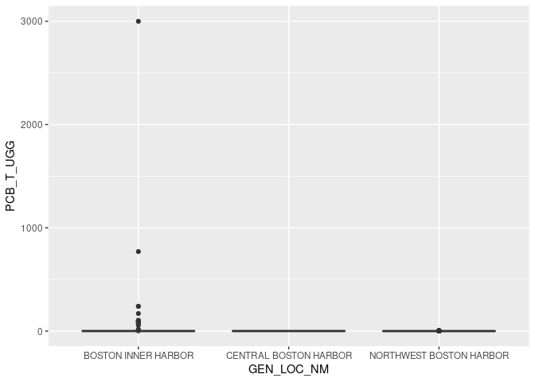

Project proposal: Contaminated sediments in the Gulf of Maine
================
Joshua Harkness and Autumn Pauly,
October 2023

## 1. Introduction

We will be looking at distributions and concentrations of contaminated
sediments in the Gulf of Maine, using the Gulf of Maine Contaminated
Sediments Database published by the U.S. Geological Survey in their
Open-File Report 02-403.

There are seven data files in this database which we may use in some
form, principally these include geographic information on stations
(collection sites), textural sediments data, and contaminants data. Each
data file includes 7847 observations in 64 to 234 variables,
respectively. In this format, each observation represents a sediment
sample; this unique ID is shared between each data file, allowing
contaminant data to be associated with geographic location and other
data. Said another way, this is a database containing information on
7847 observations collected from the Gulf of Maine between 1955 and 1994
by multiple researchers as part of multiple projects.

The database includes data on the collection of sediment samples,
including geographic location, by general and specific location
categories (i.e., “Boston Harbor”), when the sample was collected, and
by whom. Sediment textural data includes particle size, percent
composition of sand, gravel, silt, clay, etc., along with summary
statistics and distributions of particle types/sizes within each sample.
The inorganics dataset includes concentrations of many inorganic
contaminents, such as lead, mercury, arsenic, cadmium, and sample
radioactivity; we are unlikely to use this dataset in our analysis.
Organic contaminants are split between three datasets: PCBs includes
numerous polychlorinated biphenyls (PCBs), cyclohexanes, and
organochlorine pesticides (such as DDT, DDE, aldrin, dieldrin, etc.)
PAHs includes polycyclic hydrocarbons (PAHs), which are hydrocarbon
rings (excluding benzene) common in coal and oil products. General
organic contaminants includes butyls, total concentrations of PCBs,
PAHs, and pesticides, and volatility of tested samples.

Taken as a whole, this database is quite large and a comprehensive
analysis of all the data it contains is unrealistic for this 5-week long
project. It is necessary to pare this database down to the components we
wish to explore in the course of this project. We are most interested in
examining the relationship between sediments types and patterns of
spatial distribution and concentrations of organic contaminants. At this
point, we are specifically interested in the relationships between PCBs,
PAHs, organochlorine pesticides, and sediment type distribution and
composition.

## 2. Data

<!-- -->

Map of raw station data for Gulf of Maine, representing sediment
sampling locations. You can see the outline of the New England coast
where points are dense, representing greater sampling near-shore.

<!-- -->
<!-- --> Mean PCB
abundance (ug/g) are less than 0.5 for Boston Inner Harbor, Central
Boston Harbor, and Northwest Boston Harbor, but outliers are present as
high as 3000ug/g.

## 3. Ethics review

## 4. Data analysis plan
